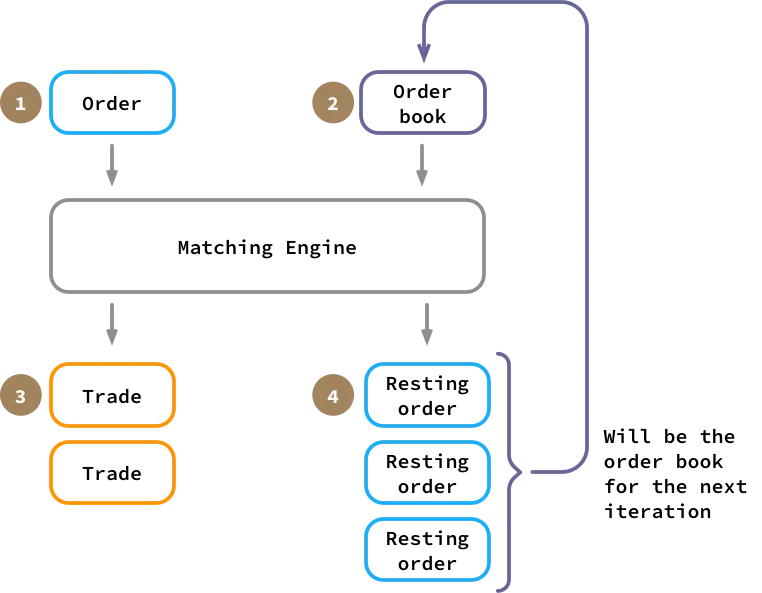

## Financial Trading Systems

<!-- Table of Contents -->
## :notebook_with_decorative_cover: Table of contents
- [About the Project](#star-about-the-project)
  * [Screenshots](#camera-screenshots)
  * [Tech Stack](#space_invader-tech-stack)
  * [Description](#gear-description)
  * [Features](#dart-features)

<!-- About the Project -->
## :star: About the project

<!-- Screenshots -->
### :camera: Screenshots

 
  

<!-- TechStack -->
### :space_invader: Tech stack

  - **Programming language**: C++
  - **IDE**: Visual Studio Community 2022
  - **Version control**: Git

<!-- About the Project -->
### :gear: Description

  
...

  <ul style="text-align: justify;">
    <li>A matching engine orchestrates transactions between market participants by pairing buy and sell orders. When an individual seeks to purchase, they submit a buy order for a specific symbol (e.g., CAC40) including an ID, side, limit price, and quantity. The limit price for a buy order signifies the maximum price the buyer is willing to pay, whereas for a sell order, it represents the minimum price at which the seller is willing to sell.</li>
    <li>All such orders are organized in a central limit order book (CLOB), which is divided into two sections: one for buy orders and the other for sell orders. Upon receiving a new order, the matching engine attempts to find a compatible order on the opposite side of the book. It continues to pair the new order with existing orders on the opposite side until the new order is fully matched or there are no longer any compatible orders available. Orders are matched based on price priority, with the most favorable prices matched first. If multiple orders share the same price, they are then matched based on the time they were submitted, with earlier orders taking precedence.</li>
    <li>When a match is successful, it results in a trade involving an aggressive order, which initiates the trade, and a passive order, which is the existing order on the opposite side. The trade's volume is the lesser of the two orders' volumes, and the trade price is set at the passive order's price.</li>
    <li>Orders within the book can be modified or removed through two actions: "pull" and "amend." Pulling an order simply removes it from the book, while amending an order allows for adjustments to its price or volume. Amending an order's price or increasing its volume results in the loss of its time priority status, necessitating a reevaluation for matches, except when the amendment reduces the order's volume.</li>
  </ul>

<!-- Features -->
### :dart: Features  

- Order
  - Class representing an order that has an unique ID, a side (Buy or Sell), a limit price, a volume and a timestamps
  - An order is stored and managed in an order book
- Order Book
  - Class that manages orders with the same symbol (e.g. CAC40) and stores them in the corresponding side (Buy or Sell)
  - All operations (insert, pull, amend, match, generate trade) are defined here
  - Orders are sorted by price, and if equal, by time priority. The most attractive prices and the first inserted orders at the top of the search
    -   std::set ensures unique orders while the custom comparator maintains the orders sorted by the specified criterias when inserted
    -   paired with std::unordered_map that stores all orders' ID and saves the corresponding iterator generated by their insertion in the set. It allow to a direct access (O(1)) to an order stored in the set
  - Trades that happened between orders are registered to maintain an historic
    -   std::vector stores the generated trades linearly, keeping the chronology by default insertion after insertion
- Trade
  - Class that handles the trade between 2 orders and store the exchange data
- Matching Engine
  - Class managing multiple central limit order books. 
  - Each order book corresponds to one symbol (e.g. CAC40) in order to manage them independently from one another
    - std::unordered_map stores order books by name (unique) and allows direct insertion (0(1)) and access (0(1)) to them
- Test Cases
  - insert order -> succesfully builds the order to store, creates an order book and stores it in it  
  - aggressive sell order -> looks for a matching buy order
  - aggressive buy order -> looks for a matching sell order
  - multiple same symbol insert and multiple match -> checks for matching sell / buy orders, remove the fulfilled orders
  - multiple symbol insert -> checks for order creation and storing in the corresponding order book + ^
  - amend order -> searches for the order to amend, depending on the criteria, reajust timestamps and resort orders if needeed + ^
